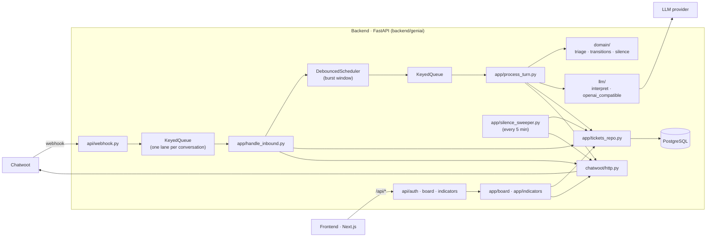
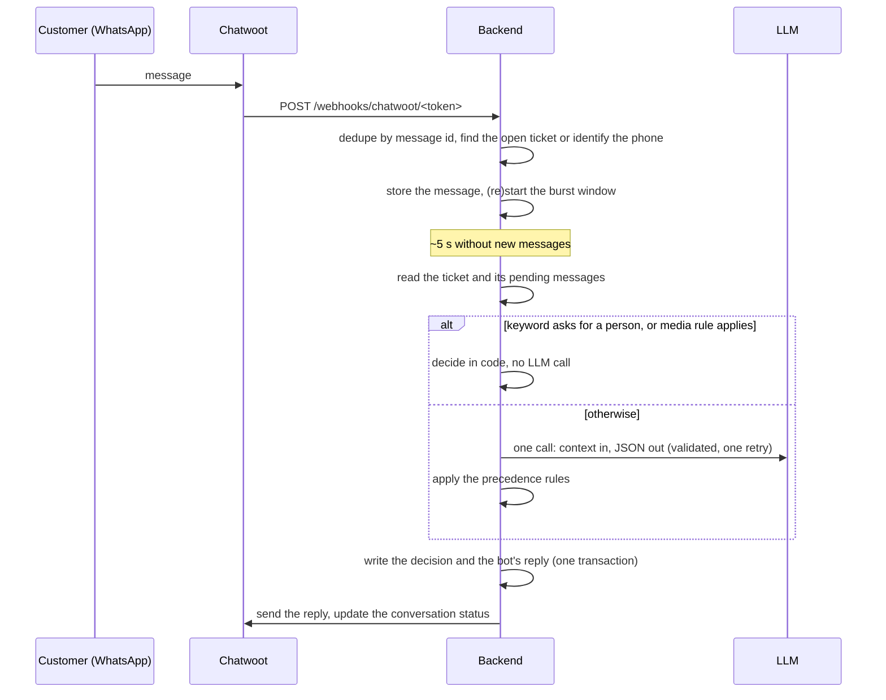

# Architecture

How the support desk works: the components, the conversation, the ticket lifecycle, the data, the
API, errors, security and tests. The product rules come from the
[design spec](specs/2026-09-23-single-agent-support-bot-design.md); this page describes the code
that implements them.

## Components

**Backend (`backend/geniai`)**, in layers:

- `domain/` holds pure rules with no I/O: the ticket columns and the moves each actor may make
  (`transitions.py`), the turn precedence (`triage.py`), the 24 h silence rule (`silence.py`), phone
  normalization (`phone.py`), the human-request keyword check (`human_request.py`), the fixed customer
  texts in Portuguese (`texts.py`) and every tunable in one place (`rules.py`).
- `app/` holds the use cases. They depend on **ports** (`app/ports.py`): `LlmPort`, `ChatwootPort`,
  a `Logger` and the database engine, bundled in `Deps`. Tests swap the ports for fakes.
- `llm/` builds the prompt, validates the model's JSON (`output_schema.py`) and retries once
  (`interpret.py`). `openai_compatible.py` talks to any OpenAI-compatible chat completions API.
- `chatwoot/` parses webhook events (`webhook.py`) and calls the Chatwoot API with retries (`http.py`).
- `db/` has the SQLAlchemy Core schema, the SQL migrations with a small runner, and the fictitious seed.
- `api/` has the FastAPI routers and the JSON response models (`schemas.py`).
- `main.py` builds the app. On start it migrates the database, wires the real adapters, reschedules
  turns left pending by a restart and starts the silence sweeper; on shutdown it stops them.

**Frontend (`frontend/src`)**: Next.js App Router. Server Components load page data from the backend
(`lib/backend.ts`, forwarding the visitor's cookie); Client Components handle drag and drop, forms
and refresh, and post to `/api/*` (`lib/api.ts`). `next.config.ts` proxies `/api/*` to the backend.
`proxy.ts` sends a visitor without a session cookie to `/login`; the backend stays the authority
and answers 401. API types come from the backend's `openapi.json` (`npm run api:types`).

## Conversation flow

1. **Inbound** (`handle_inbound.py`, under the conversation's queue lane). A duplicate Chatwoot
   message id is ignored. A message on an open ticket is attached to it: a triage ticket gets its
   burst window restarted, a ticket with a person gets no reply. With no open ticket the phone is
   normalized and looked up among active attendants:
   - **unknown** → a ticket straight in *Aguardando humano* (reason `unidentified`), a fixed
     acknowledgement, the conversation opened for the team;
   - **known** → a ticket *in triage*, with the unit copied onto it; if Chatwoot says the
     conversation is not `pending`, it is set back to `pending` so the bot keeps it.

   The database writes commit before any Chatwoot call.
2. **Burst window** (`turn_scheduler.py`): each message restarts a timer per conversation; when it
   fires, the turn runs under the same queue lane.
3. **Turn** (`process_turn.py`). The pending customer messages (those after the bot's last message)
   form one turn. The first turn gets the greeting, written by code, unless it already asks for a
   person. Later turns are decided in code first (keyword request for a person, media), then by the
   LLM through the precedence rules. The LLM runs outside any database transaction; the decision, the
   summary and category, and the bot's reply are written in one transaction, then sent.
4. **Silence** (`silence_sweeper.py`): every 5 minutes, triage tickets silent for 24 h move to
   *Sem resposta* and the conversation is resolved.
5. **Restart**: timers live in memory, so on start the backend reschedules every triage conversation
   that has unanswered customer messages.

## Ticket lifecycle and precedence

Columns: `in_triage` (shown as a counter, not a column), `resolved_by_bot`, `awaiting_human`,
`in_progress`, `resolved_by_human`, `no_response`.

- The **bot** may only move a ticket out of triage: to `resolved_by_bot`, `awaiting_human` or
  `no_response`.
- A **person** may move a card to any board column, never into triage and never onto its own column.
- Every move is recorded in `ticket_move` with the actor. The first handoff and the first take are
  stamped once (for the time indicators); closing stamps `closed_at`, reopening clears it.
- Chatwoot sync: leaving triage opens the conversation for the team, closing resolves it, reopening
  opens it again. A conversation resolved in Chatwoot moves its open ticket to `resolved_by_human`.

For each turn the first rule that applies wins (`domain/triage.py`):

1. human requested (keyword in code, or the LLM) → handoff;
2. registration mismatch → handoff;
3. off-topic or suspicious → handoff;
4. awaiting FAQ feedback → resolved, not resolved (handoff), or unclear (asked once more, then handoff);
5. an FAQ entry matches and the one FAQ attempt is unused → send it, verbatim;
6. the problem is still vague and fewer than two questions were asked → ask;
7. otherwise → handoff (`no_faq_match`).

Before the LLM: a keyword request for a person hands over; a media-only turn gets one "please type
it" reply, then hands over. If the LLM fails twice, the ticket is handed over (`llm_failure`). A
handoff that happens before any LLM result gets its summary from one more LLM call after the
customer was answered, or from the customer's own words.

## Data model

One PostgreSQL database; the DDL is `backend/geniai/db/migrations/0001_init.sql`.

| Table | Holds |
|---|---|
| `unit` | Client units (`name`, `active`) |
| `attendant` | The customer base: `phone_e164` (unique), `name`, `unit_id`, `active` |
| `category` | Closed list of problems (`system`, `name`, `active`); `key` marks the system categories `other` and `unidentified` |
| `faq_item` | FAQ entries: `category_id`, `title`, `applies_when` (sent to the LLM), `answer_text` (sent verbatim, never to the LLM), `active` |
| `team_member` | People who can take a ticket |
| `ticket` | The ticket (below) |
| `ticket_move` | Column history: `from_column`, `to_column`, `at`, `actor` (`bot` / `human`) |
| `triage_message` | The conversation while in triage: `author`, `text`, `is_media`, `chatwoot_message_id` (unique, for dedupe) |
| `schema_migration` | Applied migration files |

`ticket` keeps the attendant and a snapshot of the unit, the phone, the column, the current
`category_id` and the LLM's `bot_category_id` (kept to measure how often people correct it), the
handoff reason, the FAQ entry sent, the counters (`faq_attempted`, `clarifications_asked`,
`unclear_feedback_reasks`, `media_prompts`), the summary, the responsible person, the Chatwoot
conversation id and the timestamps `opened_at`, `handed_off_at`, `taken_at`, `closed_at`,
`last_customer_message_at`, `last_moved_at`. A partial unique index allows at most one open ticket
(triage, awaiting or in progress) per conversation.

## JSON API

Served by the backend under `/api`, proxied by the frontend. Field names are camelCase; enum values
are sent as stored (`"resolved_by_bot"`). Errors are `{"detail": "<message in Portuguese>"}`. The full
schema is `backend/openapi.json`.

| Method and path | Body | Answer |
|---|---|---|
| `GET /api/health` | — | `200 {"ok": true}` |
| `POST /api/auth/login` | `{"user", "password"}` | `204` and the session cookie, or `401` |
| `POST /api/auth/logout` | — | `204`, cookie cleared |
| `GET /api/auth/me` | — | `200 {"user"}` |
| `GET /api/board` | — | `200` the board: `generatedAt`, `triageCount`, `columns` (all five, in order), `teamMembers`, `categories`, `requireResponsible` |
| `POST /api/board/tickets/{id}/move` | `{"to": column}` | `204`, or `400` with the reason |
| `POST /api/board/tickets/{id}/take` | `{"responsibleId": id \| null}` | `204` or `400` |
| `POST /api/board/tickets/{id}/category` | `{"categoryId": id}` | `204` or `400` |
| `POST /api/board/tickets/{id}/close` | — | `204` or `400` |
| `GET /api/indicators?from=&to=&unit=&norm=0\|1` | — | `200` the query, the units and the six indicator blocks; `400 "Período inválido."` |
| `POST /webhooks/chatwoot/{token}` (not under `/api`) | a Chatwoot event | `200` `{"outcome"}`, `{"moved"}` or `{"ignored"}`; `404` on a wrong token |

Every `/api` route except health and login needs the session cookie and answers
`401 "Faça login para continuar."` without it. A malformed body or path answers
`400 "Pedido inválido."`. The indicators period is `[from, to]` in São Paulo days, the last 30 days
by default.

## Error handling

- **LLM:** about 8 s timeout, one retry, then the ticket goes to a person (`llm_failure`) and the
  customer is told the team will take over. The LLM output is validated: an unknown category rejects
  it, an unknown FAQ id becomes none, extra fields are dropped.
- **Chatwoot:** the ticket and the bot's message are stored before any send. Sends retry twice with a
  growing delay and a 10 s timeout; a final failure is logged, never raised into the flow.
- **Duplicates:** a Chatwoot message id is stored once; a repeated delivery answers `duplicate`.
- **Races:** every webhook and every turn of a conversation runs in that conversation's queue lane,
  and the database allows one open ticket per conversation. Reopening a card whose conversation
  already has an open ticket is refused with a message, not an error page.
- **Board:** a refused move keeps the card where it was and shows the backend's message.
- **Logs:** one JSON line per event on stdout; errors keep their message and stack.

## Security

- **Session:** one shared login from the backend's environment; credentials are compared in
  constant time. The session is an `itsdangerous`-signed cookie, httpOnly, `SameSite=Lax`, `Secure`
  in production, valid for 12 h.
- **Same origin:** the browser reaches the API only through the frontend's `/api` proxy, so the cookie
  is first-party and never needs CORS.
- **Mutations** accept `application/json` only; with the `SameSite=Lax` cookie a cross-site form
  cannot reach them.
- **Webhook:** the secret token is a path segment, compared in constant time; a wrong token gets `404`.
- **Configuration:** secrets come only from environment variables; errors name the variable, never
  its value. `.env` files are ignored by git.
- **The bot never executes anything:** the LLM output has no action field, and the FAQ procedure sent
  to the customer is always the team's text.
- **Data:** the repository and its tests use invented data only.

## Tests

- **Backend** (`backend/tests`, pytest on a real PostgreSQL database): pure domain rules; the schema
  and migrations; the ticket repository; the LLM contract, prompt payload and retry; the OpenAI and
  Chatwoot HTTP clients (on `httpx.MockTransport`); inbound messages, burst window, turns, silence and
  restart (with a scripted LLM, a fake Chatwoot and a clock the test controls); board and indicators;
  the HTTP API, login and webhook (through `httpx.ASGITransport`); configuration; and a check that
  `openapi.json` is current. The gate adds ruff and strict mypy.
- **Frontend** (`frontend/src/**/*.test.ts(x)`, Vitest and Testing Library): the API client,
  formatters and labels, login, the board (columns, counts, take, move failure, category, close,
  refresh) and the indicators (order, dashes, normalization link, filters, heatmap contrast).
- **End to end** (`frontend/e2e`, Playwright): both services on the dev database; login, the board,
  a real drag between columns that survives a reload, and the indicators.
- **Evaluation set** (`backend/geniai/eval`): 30 fictitious conversations run against real models to
  choose one; human-request detection must be 100%.
