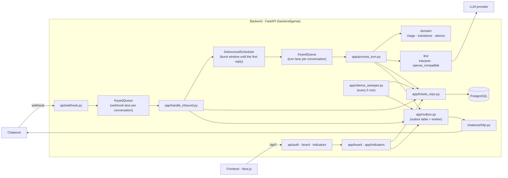
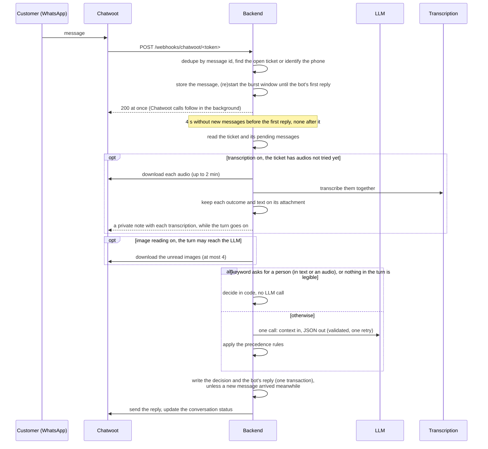

# Architecture

How the support desk works: the components, the conversation, the ticket lifecycle, the data, the
API, errors, security and tests. The product rules come from the
[design spec](specs/2026-09-23-single-agent-support-bot-design.md); this page describes the code
that implements them.

## Components

```mermaid
flowchart LR
    CW["Chatwoot"] -- "webhook" --> WH
    subgraph BE["Backend · FastAPI (backend/geniai)"]
        WH["api/webhook.py"] --> Q["KeyedQueue<br/>(webhook lane per conversation)"]
        Q --> IN["app/handle_inbound.py"]
        IN --> SCH["DebouncedScheduler<br/>(burst window until the first reply)"]
        SCH --> Q2["KeyedQueue<br/>(turn lane per conversation)"] --> TURN["app/process_turn.py"]
        TURN --> DOM["domain/<br/>triage · transitions · silence"]
        TURN --> LLMA["llm/<br/>interpret · openai_compatible"]
        SW["app/silence_sweeper.py<br/>(every 5 min)"]
        API["api/auth · board · indicators"] --> USE["app/board · app/indicators"]
        IN & TURN & SW & USE --> REPO["app/tickets_repo.py"] --> DB[("PostgreSQL")]
        IN & TURN & SW & USE --> OB["app/outbox.py<br/>(outbox table + worker)"] --> CWC["chatwoot/http.py"]
    end
    CWC --> CW
    LLMA --> LLM["LLM provider"]
    FE["Frontend · Next.js"] -- "/api/*" --> API
```

**Backend (`backend/geniai`)**, in layers:

- `domain/` holds pure rules with no I/O: the ticket columns and the moves each actor may make
  (`transitions.py`), the turn precedence (`triage.py`), the 24 h silence rule (`silence.py`), phone
  normalization (`phone.py`), which conversations the bot serves (`audience.py`), the human-request keyword check (`human_request.py`), whether the first
  messages are only a greeting (`greeting.py`), the fixed customer
  texts in Portuguese (`texts.py`), the labels that name attachments for the LLM (`attachments.py`)
  and every tunable in one place (`rules.py`).
- `app/` holds the use cases. They depend on **ports** (`app/ports.py`): `LlmPort`, `ChatwootPort`,
  `MediaFetcher` (absent when image reading is off), `AudioTranscription` (an `AudioFetcher` and a
  `TranscriberPort`, absent when transcription is off), a `Logger` and the database engine, bundled in
  `Deps`. Tests swap the ports for fakes. `app/attachments.py` decides what a turn does with the
  attachments and `app/transcription.py` transcribes the audios (see "Attachments" below).
- `llm/` builds the prompt, validates the model's JSON (`output_schema.py`) and retries once
  (`interpret.py`). `openai_compatible.py` talks to any OpenAI-compatible chat completions API.
- `chatwoot/` parses webhook events (`webhook.py`), calls the Chatwoot API with retries (`http.py`:
  messages, private notes, status changes) and downloads customer images and audios (`media.py`).
- `transcription/` talks to any OpenAI-compatible `/audio/transcriptions` API (`openai_compatible.py`),
  configured apart from the LLM (`TRANSCRIBE_*`). `geniai/audio.py` lists the audio formats it takes and
  reads how long an Ogg Opus audio lasts.
- `db/` has the SQLAlchemy Core schema, the SQL migrations with a small runner, the fictitious seed and
  the loader of the FAQ file (`faq_file.py`, run by `python -m geniai.db.cli load-faq`).
- `api/` has the FastAPI routers and the JSON response models (`schemas.py`).
- `main.py` builds the app. On start it migrates the database, wires the real adapters, reschedules
  turns left pending by a restart and starts the silence sweeper; on shutdown it stops them.

**Frontend (`frontend/src`)**: Next.js App Router. Server Components load page data from the backend
(`lib/backend.ts`, forwarding the visitor's cookie); Client Components handle drag and drop, forms
and refresh, and post to `/api/*` (`lib/api.ts`). `next.config.ts` proxies `/api/*` to the backend.
`proxy.ts` sends a visitor without a session cookie to `/login`; the backend stays the authority
and answers 401. On `/api/*` it drops the `X-Forwarded-For` and `X-Real-IP` a client sent, unless
`TRUST_UPSTREAM_PROXY=true` says a reverse proxy in front sets them. API types come from the backend's `openapi.json` (`npm run api:types`).

## Conversation flow

```mermaid
sequenceDiagram
    participant C as Customer (WhatsApp)
    participant CW as Chatwoot
    participant B as Backend
    participant L as LLM
    participant T as Transcription
    C->>CW: message
    CW->>B: POST /webhooks/chatwoot/<token>
    B->>B: dedupe by message id, find the open ticket or identify the phone
    B->>B: store the message, (re)start the burst window until the bot's first reply
    B-->>CW: 200 at once (Chatwoot calls follow in the background)
    Note over B: 4 s without new messages before the first reply, none after it
    B->>B: read the ticket and its pending messages
    opt transcription on, the ticket has audios not tried yet
        B->>CW: download each audio (up to 2 min)
        B->>T: transcribe them together
        B->>B: keep each outcome and text on its attachment
        B-->>CW: a private note with each transcription, while the turn goes on
    end
    opt image reading on, the turn may reach the LLM
        B->>CW: download the unread images (at most 4)
    end
    alt keyword asks for a person (in text or an audio), or nothing in the turn is legible
        B->>B: decide in code, no LLM call
    else otherwise
        B->>L: one call: context in, JSON out (validated, one retry)
        B->>B: apply the precedence rules
    end
    B->>B: write the decision and the bot's reply (one transaction),<br/>unless a new message arrived meanwhile
    B->>CW: send the reply, update the conversation status
```

1. **Inbound** (`handle_inbound.py`, under the conversation's webhook lane). A duplicate Chatwoot
   message id is ignored. A message on an open ticket is attached to it: a triage ticket gets its
   burst window restarted, a ticket with a person gets no reply. With no open ticket, the bot first
   decides whether it serves the conversation (`domain/audience.py`), before any ticket, reply or LLM
   call. It never serves a group (the contact's identifier or phone ends in `@g.us`, an assumption about
   the WhatsApp connector still to be checked on the real inbox) nor a contact without a usable
   Brazilian phone; in test mode (`BOT_ONLY_PHONES` not empty) it serves only the listed phones. A
   conversation it does not serve is handed to the team silently: if Chatwoot does not report it
   `open`, one status change to `open` goes to the outbox (not twice for one conversation while it
   waits, not again for a repeated delivery of the message), with one log line (conversation id and
   reason, never the phone), and nothing else: no ticket, no card, no message stored or sent. The
   webhook answers `not_served`. An open ticket keeps its flow even if its phone left the list.
   Otherwise the phone is normalized and looked up among active attendants:
   - **unknown** → a ticket straight in *Aguardando humano* (reason `unidentified`), a fixed
     acknowledgement, the conversation opened for the team;
   - **known** → a ticket *in triage*, with the unit copied onto it; if Chatwoot says the
     conversation is not `pending`, it is set back to `pending` so the bot keeps it.

   Every Chatwoot call is written as a row of the `outbox` table in the same transaction as the ticket
   change that causes it (see "Outbox" below). The webhook never waits for a turn or for Chatwoot, and
   downloads nothing.
2. **Burst window** (`turn_scheduler.py`): until the bot's first reply in the ticket, each message
   restarts a timer per conversation (`burst_window_ms`, 4 s), so "oi" / "bom dia" get one reply; once
   the ticket has a bot message, a message schedules its turn at once. Every scheduler follows this one
   rule: the inbound message, the new ticket a close opened, and the restart. The turn runs under the
   conversation's turn lane, one turn at a time.
3. **Turn** (`process_turn.py`). The pending customer messages (those after the last one a turn has
   read, `ticket.last_consumed_message_id`) form one turn. A message stored while a turn is running
   stays pending for the next turn. Before any decision, the ticket's audios are transcribed (see
   "Attachments" below), so what the customer said in one counts as text for everything that follows:
   an audio asking for a person hands over, and a first audio that describes the problem gets the
   greeting that only asks to confirm. The first turn gets the greeting, written by code, unless it already asks for a
   person. The greeting asks the customer to confirm the registered name and unit; it also asks for the
   problem only when the first messages are just a greeting (`domain/greeting.py`). Otherwise they stay
   in the conversation the LLM reads, and the turn that confirms takes the problem from them. Later turns are decided in code first (keyword request for a person, a turn with nothing
   legible), then by the LLM through the precedence rules; images and other attachments are
   described below. Once the FAQ entry was sent, the LLM also gets that entry's text
   and knowledge base (`sent_faq`); a question about it is answered from them, up to
   `max_faq_questions` (3) times, each answer followed by the "did it help?" question again. The LLM
   runs outside any database transaction; the decision, the summary and category, and the bot's
   reply are written in one transaction, then sent. That
   transaction locks the ticket and drops the decision if a person moved the ticket out of triage
   meanwhile. It also drops it, a **superseded turn**, when a customer message arrived while the turn
   prepared its reply: nothing is sent nor marked as read, and the turn that message scheduled answers
   all the pending messages in one reply (log `turn superseded`). What the dropped turn transcribed stays
   stored and its notes were already posted, so nothing is done again; what the LLM saw in its images is
   not stored, and the next turn reads them again. A reply is not dropped once the turn's oldest pending
   message waited longer than `max_reply_hold_ms` (30 s): a customer who keeps writing still gets an
   answer, and the new messages get the next turn. A message that arrives after the reply was written
   gets its own turn, which reads the whole conversation. When the decision closes the ticket (Resolved
   by bot) and customer messages arrived during the turn, it is never dropped: the ticket still closes,
   and those messages move to a new ticket, identified like any first message, whose turn is scheduled
   next, after the burst window. A webhook that waited for the ticket's lock during that close looks for
   the open ticket again, so it attaches to the new one.
4. **Silence** (`silence_sweeper.py`): every 5 minutes, triage tickets silent for 24 h move to
   *Sem resposta* and the conversation is resolved.
5. **Restart**: timers live in memory, so on start the backend reschedules every triage conversation
   that has unanswered customer messages, with the burst window only if the bot has not replied yet.
   Chatwoot calls left pending in the outbox go out when the worker starts.

### Attachments

A customer message may carry files: a photo, an audio, a video, a document. Their path:

1. **Webhook** (`chatwoot/webhook.py`, `attachment_of`): each attachment becomes a kind (`image`,
   `audio`, `video`; any other or missing `file_type` is a `file`) and Chatwoot's link (`data_url`,
   when present). The mapping is in that one function; the real payload of the WhatsApp connector is
   still to be checked with a photo.
2. **Database** (`triage_message.attachments`, JSONB, migration `0006`): the message keeps its caption
   as its text and the list of attachments (kind and link). A message with attachments and no text is
   stored with `is_media` and the text `[mídia]`, like any media-only message; one stored
   before the column existed has no attachments and is treated as a file the bot cannot open.
3. **Audio, at the start of the turn** (`app/transcription.py`, `chatwoot/media.py`,
   `transcription/openai_compatible.py`), outside any transaction and before any decision, when
   `TRANSCRIBE_*` are set. The ticket's customer audios no turn tried yet are downloaded with the same
   guards as an image (below), at most `max_audio_bytes` (5 MB) within `audio_download_timeout_ms`
   (15 s), in the formats the transcription API takes (Ogg, MP3, M4A/MP4, WAV, WebM, FLAC; a WhatsApp
   voice message is `audio/ogg`, Opus). An audio longer than `max_audio_seconds` (120 s) is not
   transcribed: the duration of an Ogg Opus audio is read from the file (the granule position of its
   last page, minus the pre-skip, over 48 000); for the other formats, a size over
   `max_untimed_audio_bytes` (2 MB, about 2 min of a 128 kbps MP3) counts as too long. The rest are
   transcribed together (`POST {TRANSCRIBE_BASE_URL}/audio/transcriptions`, multipart: the file,
   `model`, `language=pt`), each within `transcribe_timeout_ms` (15 s); an empty text is a failure. Each
   audio's outcome is kept on its attachment at once: `transcribed` with the text (on one line, at most
   3 000 characters), `too_long` or `failed`; later turns use it and never transcribe it again. Each
   transcription is then posted as a private note in the conversation, `Transcrição do áudio (bot):
   <text>`, straight through the Chatwoot adapter and its retry rule, not the outbox. The notes go out
   in order, in the background, while the turn decides (and calls the LLM); the turn waits for them only
   before it writes its reply, so a note comes before the reply in Chatwoot without adding its time to
   the turn. A note that fails is logged and the turn goes on. The webhook ignores the note (it is
   outgoing and private). With transcription off nothing is downloaded and every audio stays as it
   arrived.
4. **Image download in the turn** (`app/attachments.py`, `chatwoot/media.py`), outside any transaction and
   only when the turn may reach the LLM (not for the greeting or a request for a person). The unread
   images of the ticket's customer messages are downloaded, the most recent
   `max_images_per_turn` (4) of them; older ones are past the limit. An image is downloaded only from
   the configured Chatwoot (same scheme, host and port as `CHATWOOT_BASE_URL`); the API token goes
   only to that origin, and up to 3 redirects are followed (Chatwoot usually redirects to its
   storage, which gets no token), never from https to http. At most `max_image_bytes` (5 MB), read as
   a stream and cut when it passes, within `image_download_timeout_ms` (15 s), and only JPEG, PNG or
   WebP. A failure never stops the turn: the image counts as not opened. The bytes stay in memory.
   With `LLM_READS_IMAGES=false` nothing is downloaded and every image counts as not opened.
5. **LLM** (`llm/prompt.py`, `llm/openai_compatible.py`): each message reaches the LLM as the labels of
   its attachments followed by its caption: `[imagem 1]` (sent with this call, in order),
   `[imagem: <description>]` (seen in an earlier turn), `[imagem — não foi possível abrir]`,
   `[imagem — além do limite, não vista]`, `[áudio transcrito: "<text>"]`,
   `[áudio — não foi possível ouvir]` (transcription on, the audio was not downloaded or not
   transcribed), `[áudio — passou de 2 minutos, não ouvido]` (transcription on, longer than
   `max_audio_seconds`; the "2 minutos" is fixed in the text), `[áudio — o bot não ouve]` (transcription
   off), `[vídeo — o bot não abre]`, `[arquivo — o bot não abre]`. The prompt explains them, counts what
   an image shows and what a transcribed audio says as what the customer wrote (allowing for
   transcription mistakes), and forbids saying an attachment did not arrive or asking for it again. When
   what it can read is not enough, the reply asks for the problem in text: for an audio not heard or
   longer than 2 minutes it says so, never that the bot cannot hear audios. The team's card summary reads
   the same labels. With
   images, the user message goes in parts: the text, then each image as a base64 data URI; without,
   the request is plain text, as for a text-only model.
6. **Description**: the LLM returns `image_descriptions`, one short description per image sent. The
   turn stores on each image its outcome (`seen`, `failed`, `over_limit`) and, when seen, the
   description (`[imagem vista pelo bot]` when the LLM gave none); later turns show the description
   and never send the image again. An image in a turn decided before the LLM stays unread, so the
   next LLM turn reads it: a photo sent as the first message is read in the turn after the greeting.

A turn with nothing legible (no text, no transcribed audio and no image that opened) gets one request
for text, then a handoff (`media`). The request says what the bot could not read: "Não consegui abrir a imagem" when
only images failed; audio, video or files when there was one; the general text (audio, images or files) when image
reading is off. With transcription on, no request says the bot cannot hear audio: when only audios were not
heard it says "Seu áudio passou de 2 minutos…" (one was too long) or "Não consegui ouvir seu áudio…";
beside anything else the audio part is left out ("Ainda não consigo abrir vídeos ou arquivos…", or "imagens
ou arquivos" with image reading off; the image text when only images failed besides). Logs name each image by type, size and failure reason, never by its link or content.
Each audio logs `audio read` (type, size, seconds) or `audio not read` (the download's failure reason),
then `audio transcribed` (seconds, time taken) or `audio not transcribed` (reason: `too_long`, `timeout`,
`status` with the provider's HTTP status, `error` or `empty`), never its link nor what was said.

### Outbox

`app/outbox.py` is a transactional outbox. A message or a status change for a conversation is a row
(`kind` `message` or `status`, `state` `pending`; `chatwoot_message_id` for the hand-over of a
conversation the bot does not serve, which has no ticket to remember the message), inserted in the transaction that changes the
ticket, so nothing is sent before the commit and nothing is lost if the process stops. After the
commit the use case wakes the worker (`OutboxWorker`, started and stopped with the app). The worker
also looks for pending rows at start and every 5 s. It sends them in id order within each
conversation, conversations in parallel, and marks each row `sent`, or `failed` with the error,
which is logged; a failed row is not tried again (the Chatwoot adapter already repeats what is safe
to repeat). On shutdown it waits up to 10 s for the current delivery; what is left stays pending for
the next start. Board actions (move, take, release, close) answer as soon as the ticket is written,
without waiting for Chatwoot.

## Ticket lifecycle and precedence

Columns: `in_triage` (shown as a counter, not a column), `resolved_by_bot`, `awaiting_human`,
`in_progress`, `resolved_by_human`, `no_response`.

- The **bot** may only move a ticket out of triage: to `resolved_by_bot`, `awaiting_human` or
  `no_response`.
- A **person** may move a card to any board column, never into triage and never onto its own column.
- Every move is recorded in `ticket_move` with the actor. The first handoff and the first take are
  stamped once (for the time indicators); closing stamps `closed_at`, reopening clears it.
- Chatwoot sync: leaving triage opens the conversation for the team, closing resolves it, reopening
  opens it again. A conversation resolved in Chatwoot moves its open ticket to `resolved_by_human`.

For each turn the first rule that applies wins (`domain/triage.py`):

1. human requested (keyword in code, or the LLM) → handoff;
2. registration mismatch → handoff;
3. off-topic or suspicious → handoff;
4. awaiting FAQ feedback → resolved; not resolved (handoff); a question answered from the entry's
   knowledge base while fewer than three were answered (answer it, stay in triage); any other question,
   or the fourth (handoff `faq_not_resolved`, the question added to the summary); unclear (asked once
   more, then handoff);
5. an FAQ entry matches and the one FAQ attempt is unused → send it, verbatim;
6. the customer has not yet said what the problem is and no question was asked yet → ask (one question
   at most); a clear request no FAQ entry covers goes to rule 7 with no question;
7. otherwise → handoff (`no_faq_match`).

Before the LLM: a keyword request for a person hands over; a turn with nothing legible (only
attachments, and no image that opened) gets one "please type it" reply, then hands over. If the LLM fails twice, the ticket is handed over (`llm_failure`). A
handoff that happens before any LLM result gets its summary from one more LLM call after the
customer was answered, or from the customer's own words (see "Card summary" under Error handling).

The code decides every handoff; the sentence the customer gets depends on who read the turn. When the
LLM's own reading points to a handoff (a request for a person, a registration mismatch, off-topic, FAQ
feedback "not resolved" or unclear, a question it found no answer for, or no entry fits and nothing is
left to clarify), the LLM writes it in `handoff_reply`: one or two short sentences that name the customer's subject
and say the support team carries on in this chat, with no promise of speed (`domain/triage.py`,
`handoff_text`). Otherwise the fixed text of `texts.py` goes: a handoff before
the LLM (keyword, media, unidentified, LLM failure), a limit only the code knows (the fourth question,
the second clarification) or an empty sentence.

## Data model

One PostgreSQL database; the DDL is `backend/geniai/db/migrations/0001_init.sql`.

| Table | Holds |
|---|---|
| `unit` | Client units (`name`, `active`) |
| `attendant` | The customer base: `phone_e164` (unique), `name`, `unit_id`, `active` |
| `category` | Closed list of problems (`system`, `name`, `active`); `key` marks the system categories `other` and `unidentified` |
| `faq_item` | FAQ entries: `category_id`, `title`, `applies_when` (sent to the LLM), `answer_text` (sent verbatim to the customer) and `knowledge_base` (for questions about the entry), which reach the LLM only after the entry was sent, and only those of the entry sent; `active` |
| `team_member` | People who can take a ticket |
| `ticket` | The ticket (below) |
| `ticket_move` | Column history: `from_column`, `to_column`, `at`, `actor` (`bot` / `human`) |
| `triage_message` | The conversation while in triage: `author`, `text` (a caption, for a message with attachments), `is_media` (attachments and no text), `chatwoot_message_id` (unique, for dedupe), `attachments` (JSONB list: kind, link and, for an image an LLM turn read, its outcome and description) |
| `schema_migration` | Applied migration files |

`ticket` keeps the attendant and a snapshot of the unit, the phone, the column, the current
`category_id` and the LLM's `bot_category_id` (kept to measure how often people correct it), the
handoff reason, the FAQ entry sent, the counters (`faq_attempted`, `faq_questions_answered`,
`clarifications_asked`, `unclear_feedback_reasks`, `media_prompts`), the summary, the responsible
person, the Chatwoot conversation id and the timestamps `opened_at`, `handed_off_at`, `taken_at`, `closed_at`,
`last_customer_message_at`, `last_moved_at`, and `last_consumed_message_id`, the last customer message a
turn has read. A partial unique index allows at most one open ticket
(triage, awaiting or in progress) per conversation.

`category` and `faq_item` are loaded from `backend/faq/faq.json` by `load-faq`: the whole file is
validated first, then one transaction creates or updates categories by `key` and entries by category
and title, and deactivates what the file no longer lists (never deletes it, since tickets point to it).
Each category in the file has its `system` and `name` (the label "system / name").

## JSON API

Served by the backend under `/api`, proxied by the frontend. Field names are camelCase; enum values
are sent as stored (`"resolved_by_bot"`). Errors are `{"detail": "<message in Portuguese>"}`. The full
schema is `backend/openapi.json`.

| Method and path | Body | Answer |
|---|---|---|
| `GET /api/health` | — | `200 {"ok": true}` |
| `POST /api/auth/login` | `{"user", "password"}` | `204` and the session cookie, `401`, or `429` after too many failures from one address |
| `POST /api/auth/logout` | `{}` | `204`, cookie cleared (with or without a valid session); `400` when the body is not JSON |
| `GET /api/auth/me` | — | `200 {"user"}` |
| `GET /api/board` | — | `200` the board: `generatedAt`, `triageCount`, `columns` (all five, in order), `teamMembers`, `categories`, `requireResponsible` |
| `POST /api/board/tickets/{id}/move` | `{"to": column}` | `204`, or `400` with the reason |
| `POST /api/board/tickets/{id}/take` | `{"responsibleId": id \| null}` | `204` or `400`. On a closed ticket it reopens it into In progress |
| `POST /api/board/tickets/{id}/release` | `{}` | `204` or `400`: clears the responsible of an In progress ticket and moves it back to Awaiting human |
| `POST /api/board/tickets/{id}/category` | `{"categoryId": id}` | `204` or `400` |
| `POST /api/board/tickets/{id}/close` | — | `204` or `400` |
| `GET /api/indicators?from=&to=&unit=&norm=0\|1` | — | `200` the query, the units and the six indicator blocks; `400 "Período inválido."` |
| `POST /webhooks/chatwoot/{token}` (not under `/api`) | a Chatwoot event | `200` `{"outcome"}`, `{"moved"}` or `{"ignored"}`; `404` on a wrong token |

Every `/api` route except health, login and logout needs the session cookie and answers
`401 "Faça login para continuar."` without it. A malformed body or path answers
`400 "Pedido inválido."`. The indicators period is `[from, to]` in São Paulo days, the last 30 days
by default.

## Error handling

- **LLM:** 5 s timeout in a turn with text only and 8 s in a turn with images, one retry, then the
  ticket goes to a person (`llm_failure`) and the customer is told the team will take over. The LLM output is validated: an unknown category rejects
  it, an unknown FAQ id becomes none, extra fields are dropped.
- **Card summary** (`app/card_summaries.py`): the summary of a handoff decided before any LLM result
  (a keyword, media, an LLM failure) runs as its own task once the turn has queued its reply: it holds
  neither the conversation's turn lane nor a place among the running turns, and stopping the app
  cancels it. It calls the LLM only when the LLM is free, which the burst scheduler knows: no
  conversation in its burst window and no turn running (`DebouncedScheduler.wait_idle`); summaries go
  one at a time. A customer's turn never waits for a summary. The burst window of a conversation's first
  messages (4 s) lets a summary that started just before them (1.5 to 3 s) finish first; a later message
  runs its turn at once, alongside the summary. The whole summary, wait
  included, has 30 s (`summary_deadline_ms`); past it, or when the LLM fails (and at once after
  `llm_failure`), the card gets the customer's words (up to 280 characters) in the `other` category.
- **Chatwoot:** the ticket and the bot's message are stored before any send. A call is repeated (twice,
  with a growing delay) only when it surely was not processed: a connection failure or a 502, 503 or
  504 answer. A read timeout (30 s) or any other answer ends it at once, because repeating a POST that
  Chatwoot did process would send the customer the same message twice. A final failure is logged,
  never raised into the flow.
- **Images:** a download that fails (host, redirects, status, type, size, time) leaves the image
  "not opened" and the turn goes on with what is legible; it is logged with the reason.
- **Audios:** a download or a transcription that fails, or an audio too long, leaves the audio "not
  heard": the turn goes on with what is legible, and the media rule applies when nothing is. A private
  note that fails is logged, never raised into the turn.
- **Duplicates:** a Chatwoot message id is stored once (with the ticket's messages, or on the outbox
  row of a conversation handed to the team); a repeated delivery answers `duplicate`.
- **Races:** the webhooks of a conversation run one at a time in its webhook lane and its turns in its
  turn lane; both lock the ticket row when they write, and the database allows one open ticket per
  conversation. The lanes live in the process, so the backend runs a single worker. Reopening a card whose conversation
  already has an open ticket is refused with a message, not an error page.
- **Board:** a refused move keeps the card where it was and shows the backend's message.
- **Logs:** one JSON line per event on stdout; errors keep their message and stack. Each turn whose
  reply reaches the outbox logs `turn timing`: the wait from the last customer message to the turn,
  the image downloads, each LLM attempt with how it ended, and the time until the reply was queued.
  A turn dropped for a message that arrived meanwhile logs `turn superseded` instead, with the ticket id
  and how many messages arrived (`arrived`).
  Each Chatwoot call logs its own time (`Chatwoot call sent`, with the conversation id). Each card
  summary logs `card summary`: the ticket id, the wait for the LLM to be free (`waitedMs`), each LLM
  attempt with how it ended (`llmMs`, `llmOutcomes`) and whether the customer's words went instead
  (`fallback`). None of these lines has the text, the phone or a link.

## Security

- **Session:** one shared login from the backend's environment; credentials are compared in
  constant time. The session is an `itsdangerous`-signed cookie, httpOnly, `SameSite=Lax`, `Secure`
  in production, valid for 12 h. The signed value carries a digest of the password, so changing
  `BOARD_PASSWORD` ends every open session.
- **Login attempts** (`api/login_limit.py`, in memory): 10 failures from one client address in 15
  minutes answer `429` until the window passes. The client address is the rightmost
  `X-Forwarded-For` entry that is not a trusted proxy, read only when the peer is in
  `TRUSTED_PROXY_IPS`; entries a client adds on the left are never believed. A request from a trusted
  proxy with no usable address (no reverse proxy in front of the frontend) is never refused: those
  logins share one count and each waits 1 s per recent failure, up to 5 s.
- **Same origin:** the browser reaches the API only through the frontend's `/api` proxy, so the cookie
  is first-party and never needs CORS.
- **Mutations** accept `application/json` only; with the `SameSite=Lax` cookie a cross-site form
  cannot reach them.
- **Webhook:** the secret token is a path segment, compared in constant time; a wrong token gets `404`.
- **Configuration:** secrets come only from environment variables; errors name the variable, never
  its value. `.env` files are ignored by git.
- **The bot never executes anything:** the LLM output has no action field, and the FAQ procedure sent
  to the customer is always the team's text.
- **The bot does not invent answers:** a question about the FAQ entry sent is answered only from that
  entry's text and knowledge base; the prompt forbids general knowledge and asking for or sending
  passwords. The LLM never sees another entry's text or knowledge base. Code answers at most three
  questions, and hands over when the LLM reports no answer or writes an empty one.
- **Images:** downloaded only from the configured Chatwoot, with the token only there; kept in
  memory for the turn and sent to the configured LLM provider, never written to disk or to the
  database (only the LLM's short description is). Off unless `LLM_READS_IMAGES=true`.
- **Data:** the tests use invented data only. The FAQ file holds the support team's instructions and
  no unit, person, phone number or password.

## Tests

- **Backend** (`backend/tests`, pytest on a real PostgreSQL database): pure domain rules; the schema
  and migrations; the ticket repository; the LLM contract, prompt payload and retry; the OpenAI and
  Chatwoot HTTP clients and the image download (on `httpx.MockTransport`); turns with images and
  other attachments; inbound messages, burst window, turns, silence and
  restart (with a scripted LLM, a fake Chatwoot and a clock the test controls); board and indicators;
  who the bot serves (groups, test mode) and the silent hand-over; the HTTP API, login and webhook (through `httpx.ASGITransport`); configuration; and a check that
  `openapi.json` is current. The gate adds ruff and strict mypy.
- **Frontend** (`frontend/src/**/*.test.ts(x)`, Vitest and Testing Library): the API client,
  formatters and labels, login, the board (columns, counts, take, move failure, category, close,
  refresh) and the indicators (order, dashes, normalization link, filters, heatmap contrast).
- **End to end** (`frontend/e2e`, Playwright): both services on a database of their own
  (`geniai_e2e`, or `E2E_DATABASE_URL`), created when missing; login, the board,
  a real drag between columns that survives a reload, and the indicators.
- **Evaluation set** (`backend/geniai/eval`): 34 fictitious conversations (only the 2 vague ones expect a
  question; a clear request no FAQ entry covers expects none), plus 8 questions about an FAQ entry
  already sent (half answered by its knowledge base, half not), 4 answers to it ("that's not it" three
  times, read as not resolved, and one that solved it), and, for models that read
  images, 4 invented screenshots, run against real models to choose one; human-request detection
  must be 100%.
