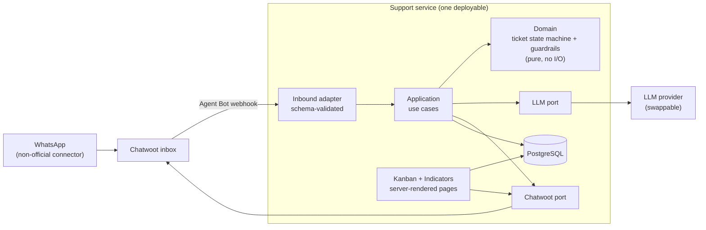
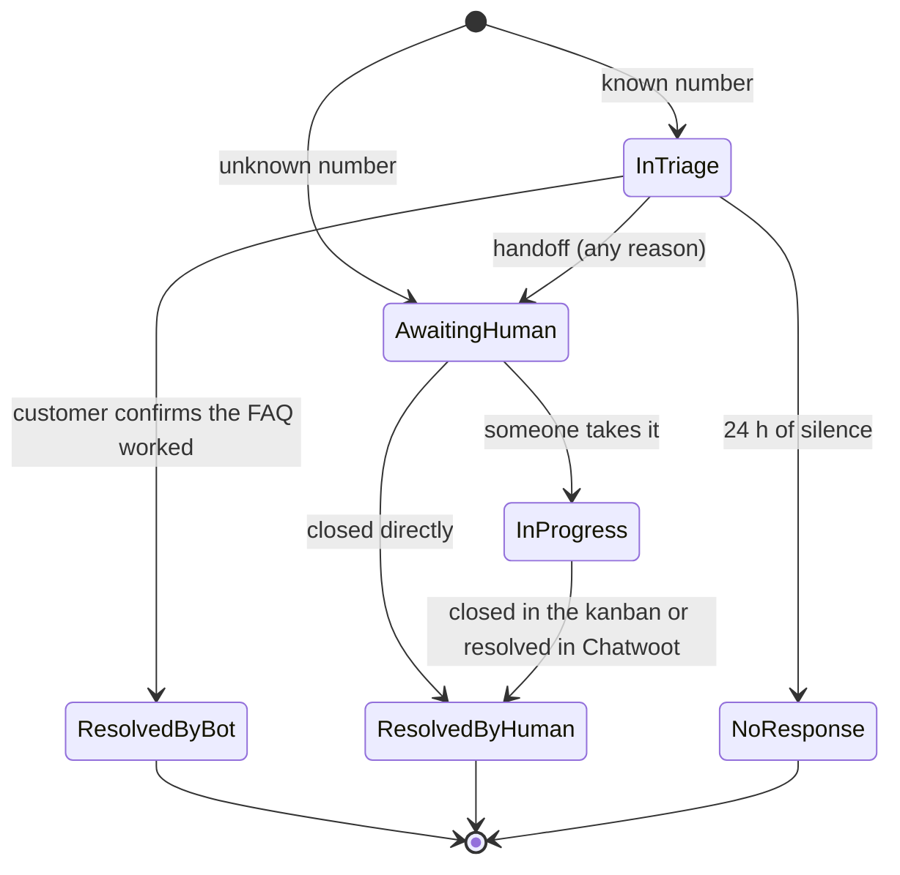

# Single-Agent Support Bot — Design

- **Date:** 2026-09-23
- **Status:** design approved in brainstorming; written spec under review
- **Scope:** the support chatbot (one LLM agent), the ticket board (kanban) and the indicators page

## 1. Summary

Customers — people working at our client units — message our support WhatsApp number. The bot
identifies them by phone number against a base we maintain, opens a ticket right away, listens to the
problem and, when the problem matches an entry in our FAQ, sends that entry's instructions once. If
the customer asks for a person at any moment, the bot hands the conversation over immediately.

Every ticket lands on a kanban board that the support team controls, already summarized and
categorized. Because every ticket carries its unit, category and outcome as structured fields, the
same data answers: which problems happen most, how many tickets were solved and how, and which units
suffer most from a given problem.

## 2. Goals and non-goals

**Goals**

- Identify the customer by phone number only, before anything else happens.
- Open a ticket as soon as the customer is identified.
- Resolve known problems with a single FAQ attempt, using text written by the support team.
- Hand over to a human immediately whenever the customer asks for one.
- Deliver every ticket to a kanban with a summary, a category, the unit and the outcome.
- Provide indicators by period, unit and category.

**Non-goals**

- The bot **never executes anything** in customer systems (no adding or removing users, no changing
  numbers). It identifies, understands, answers from the FAQ, summarizes and hands over.
- The bot does not troubleshoot beyond the FAQ and does not invent procedures.
- No audio transcription or image understanding in this version.
- No per-person logins, no report export, no e-mailed reports, no period-over-period comparison.

## 3. Decisions taken in brainstorming

| # | Decision | Alternatives rejected | Why |
|---|---|---|---|
| 1 | **One LLM agent** conducts the conversation. There is no numbered menu and no external form. | Hybrid (agent plus a form for structured requests) | The agent collects and summarizes the problem itself; the ticket is the deliverable. |
| 2 | **Code on rails, LLM as interpreter.** Code owns the flow; the LLM is called once per customer turn and returns JSON validated by a schema. | Free agent with tools; LLM in a separate Python service | Business rules become testable `if`s instead of prompt requests. One call per turn keeps cost and latency down. A separate service adds a deployable for no gain. |
| 3 | The **kanban lives inside this project** — same service, same database. | Reusing an external dashboard; using Chatwoot as the board | One source of truth; indicators come straight from the same tables. |
| 4 | **Five columns, in this order:** Resolved by bot → Awaiting human → In progress → Resolved by human → No response. | Two columns (resolved / open) | Keeps "nobody took it yet" apart from "someone is on it", which the waiting-time indicator needs. Keeps customers who vanished from inflating the bot's success rate. |
| 5 | **Closed category list** (system + problem), with "Other". The agent can only choose from it; humans can correct it on the card. | Free categories written by the agent; closed list plus a free tag | Charts stay comparable over time. |
| 6 | **One FAQ attempt, FAQ-only.** No FAQ match means summarize and hand over. | Two attempts; letting the agent suggest solutions outside the FAQ | Every instruction the customer receives was written by the team; "resolved by bot" means "resolved by the FAQ". |
| 7 | **Single shared login**; the responsible person is chosen on the card. | Individual logins | Simpler for a two-person team. Move history still records *when*, not *who*. |
| 8 | **The LLM is provider-agnostic**; the model is chosen by a comparative evaluation once the agent works. DeepSeek V4.1 Flash is the leading candidate (see §12). | Committing to DeepSeek now | Latency and behavior are measured on our own conversations before committing. |
| 9 | The bot is a **Chatwoot Agent Bot**. The WhatsApp number is connected to Chatwoot through a non-official connector. | Receiving WhatsApp webhooks directly | Our number does not use the official API, and humans answer customers inside Chatwoot. |
| 10 | **Registration confirmation is kept.** If the customer says they are not the registered person, or that they are from a different unit, the bot stops and hands over. | Continuing and flagging the mismatch | A conservative cut: a wrong identity must not flow into an automated answer. |
| 11 | **No personal-data filtering in the prompt.** The LLM may receive the customer's name, unit and messages. | Keeping name, unit and phone out of the prompt | Owner's decision. |
| 12 | Carried-over principles: **identify by phone only**; **unknown number goes to a human, never to the FAQ**; **the bot never executes** (see §2). | — | Reconfirmed during this brainstorming. |

## 4. Architecture



- **Domain** holds the ticket state machine, the counters (one FAQ attempt, at most two clarifying
  questions) and the precedence rules of §5.3. It has no I/O and is unit-tested.
- **LLM port** hides the provider. Swapping models means writing one adapter.
- **Chatwoot port** sends messages, toggles conversation status and builds conversation links.
- **Baseline stack:** TypeScript on Node, Fastify (webhook and pages), Zod (every inbound payload
  and every LLM output), PostgreSQL. The ORM, test runner and UI helpers are chosen in the
  implementation plan.
- The customer-facing language is **Brazilian Portuguese**. Code and docs are in English.

## 5. Conversation flow

### 5.1 Steps

1. **A message arrives** through the Chatwoot Agent Bot webhook. Duplicate deliveries are ignored by
   message id. The bot waits for **~5 s of silence** and processes a burst of short messages
   ("oi", "tudo bem?", "meu número caiu") as one turn.
2. **Identification (code, before anything else).** The sender's phone is normalized to E.164,
   including the Brazilian 9th mobile digit, and looked up in the `attendant` table.
   - **Unknown number:** a ticket is created directly in **Awaiting human** with category
     "Unidentified" and handoff reason `unidentified`. The bot replies with a fixed acknowledgement
     only ("recebemos sua mensagem, a equipe já fala com você"). No FAQ is ever offered.
   - **Known number:** a ticket is created in the hidden state **in triage**.
3. **Greeting (code, not the LLM).** It uses the registered name and unit, asks the customer to
   confirm them and to describe the problem.
4. **Each customer turn** goes to the LLM (§6). Code applies the result using the precedence in §5.3.
5. **FAQ match:** the bot sends the FAQ entry's **verbatim text**. The LLM writes only the framing
   sentence, never the procedure. Then the bot asks whether it solved the problem.
   - Resolved → **Resolved by bot**.
   - Not resolved → **Awaiting human** (`faq_not_resolved`).
   - Unclear answer → the bot asks once more; a second unclear answer → **Awaiting human**.
6. **No FAQ match:** the LLM may ask **at most two clarifying questions** so the summary is useful,
   then the ticket goes to **Awaiting human** (`no_faq_match`).
7. **Handoff:** the bot tells the customer the team will take over, sets the ticket to
   **Awaiting human**, switches the Chatwoot conversation from bot-handled to open, and **stays
   silent** in that conversation while the ticket is open.
8. **Messages on an open ticket** (Awaiting human or In progress) attach to that ticket; the bot does
   not answer. After a ticket is closed (Resolved by bot, Resolved by human or No response), the next
   message opens a new ticket.
9. **Silence:** a ticket still in triage, or waiting for FAQ feedback, with no customer message for
   **24 h** (configurable) goes to **No response**.
10. **Media** (audio, image, document): the bot asks the customer to type the problem, once. Media
    again → **Awaiting human** (`media`).

### 5.2 Ticket lifecycle



"In triage" is **not a kanban column**. The board shows it as a counter ("3 conversations with the
bot now"). The ticket enters one of the five columns once it has an outcome. Humans can drag cards
between columns freely; every move is recorded.

### 5.3 Precedence rules (enforced in code)

For each customer turn, the first rule that applies wins:

1. **Human requested** — a keyword check in code runs **before** the LLM call (for example
   "atendente", "humano", "pessoa", "falar com alguém"), and the LLM also flags it. Either one
   triggers the handoff. It keeps working if the LLM is down.
2. **Registration mismatch** — the customer denies the registered name or unit → handoff
   (`registration_mismatch`).
3. **Off-topic or suspicious** content → handoff (`off_topic`).
4. **Awaiting FAQ feedback** → apply step 5 of §5.1.
5. **FAQ match**, and the FAQ attempt not yet used → send the FAQ entry.
6. **Clarification needed**, and fewer than two questions asked → ask.
7. Otherwise → handoff (`no_faq_match`).

## 6. LLM contract

**Input:** system prompt (role, tone, the rules above), the active category list, the active FAQ
entries (id, category, title and "when it applies" description — the verbatim answer text stays in
code), the customer's registered name and unit, the triage messages so far and the counters' state.

**Output** (validated with Zod; categories and FAQ ids are enums built from the database):

```ts
{
  human_requested: boolean,
  registration_mismatch: boolean,
  off_topic: boolean,
  category_id: CategoryId,          // must be in the active list
  faq_item_id: FaqItemId | null,    // unknown id is treated as null
  faq_feedback: "resolved" | "not_resolved" | "unclear" | null,
  needs_clarification: boolean,
  summary: string,                  // what the kanban card shows
  reply: string                     // framing text only; never an FAQ procedure
}
```

There is **no action field**: the LLM has no way to ask for anything to be executed. The model runs
without its reasoning mode, to keep latency within the target.

## 7. Data model

| Table | Purpose | Key fields |
|---|---|---|
| `unit` | Client units | id, name, active |
| `attendant` | The customer base, loaded by the team | id, phone_e164 (unique), name, unit_id, active |
| `category` | Closed list, never deleted | id, system, name, active, created_at |
| `faq_item` | FAQ entries, editable without deploy | id, category_id, title, applies_when, answer_text, active |
| `team_member` | People who can be responsible | id, name, active |
| `ticket` | The canonical ticket | see below |
| `ticket_move` | Column history | ticket_id, from, to, at, actor (`bot` / `human`) |
| `triage_message` | Conversation with the bot, used as LLM context | ticket_id, author, text, at, chatwoot_message_id |

**`ticket` fields:** id, attendant_id (null when unidentified), unit_id (snapshot), phone_e164,
column (`in_triage`, `resolved_by_bot`, `awaiting_human`, `in_progress`, `resolved_by_human`,
`no_response`), category_id (current), **bot_category_id (the agent's original choice, kept to
measure its accuracy)**, handoff_reason (`human_requested`, `faq_not_resolved`, `no_faq_match`,
`unidentified`, `registration_mismatch`, `off_topic`, `media`, `llm_failure`), faq_item_id,
faq_attempted, clarifications_asked, summary, responsible_id (null = unassigned),
chatwoot_conversation_id, opened_at, handed_off_at, taken_at, closed_at.

## 8. Kanban

- **Columns:** Resolved by bot · Awaiting human · In progress · Resolved by human · No response,
  plus the "conversations with the bot now" counter.
- **Card:** unit, category, summary, responsible, time since the last move, link to the Chatwoot
  conversation.
- **Actions:** drag between columns; **take** (pick who is taking it — the login is shared — which
  sets the responsible person and moves the card to In progress); correct the category; close.
- **Chatwoot sync, both ways:** closing a card resolves the Chatwoot conversation, and resolving the
  conversation in Chatwoot moves the card to Resolved by human. Nobody has to close the same thing
  twice.
- **Login:** one shared credential from environment variables, cookie session.

## 9. Indicators

One page, filtered by period and unit. Everything is computed from the tables in §7.

1. **Volume** — tickets per week and month: total, by unit, by category.
2. **Outcomes** — distribution across the five columns and, for handed-off tickets, by handoff reason.
   **Bot resolution rate** = Resolved by bot ÷ identified tickets that reached a column. No response
   is shown as its own share, so it never counts as a success.
3. **Unit × category heatmap** — the "which unit suffers most from problem X" view, with an option to
   normalize by the number of attendants per unit so larger units do not always look worst.
4. **Time** — time in Awaiting human until someone takes it, and time until close.
5. **FAQ health** — per entry: times used and share confirmed as resolved. Low shares flag text to
   rewrite.
6. **Agent health** — share of categories corrected by humans (classification error) and the share
   falling into "Other". A growing "Other" signals a missing category.

## 10. Error handling

- **LLM timeout (~8 s), provider error or invalid JSON:** one retry. If it fails again, the ticket goes
  to **Awaiting human** (`llm_failure`) and the customer is told the team will take over. The customer
  never goes unanswered.
- **Chatwoot send failure:** the ticket is written **before** any outbound message, so nothing is lost.
  Sends are retried a few times and logged.
- **Duplicate webhooks:** ignored by Chatwoot message id.
- **Message bursts:** grouped by the ~5 s silence window (§5.1).
- **Media:** handled as in §5.1, step 10.

## 11. Testing

- **Unit tests (TDD)** for the domain: ticket transitions, the precedence rules, the FAQ-attempt and
  clarification counters, the 24 h silence rule, and phone normalization (including 12- vs 13-digit
  Brazilian mobiles). The LLM is replaced by a fake.
- **Schema tests** for the LLM output: unknown category rejected, unknown FAQ id treated as null.
- **Evaluation set:** about 30 anonymized sample conversations run against the real model. It
  reports, per model:
  - human-request detection — **must be 100%** (a blocking requirement);
  - category accuracy against the expected label;
  - FAQ match accuracy;
  - p50 and p95 latency, measured from Brazil.

  **This same set is the model comparison** of decision 8: candidates run side by side on it.

## 12. LLM cost analysis — DeepSeek V4.1 Flash (candidate)

Source: official API pricing page (api-docs.deepseek.com, model `deepseek-flash`, released
2026-09-10). US$ per 1M tokens:

| | Off-peak | Peak |
|---|---|---|
| Input, cache hit | 0.003 | 0.006 |
| Input, cache miss | 0.15 | 0.30 |
| Output | 0.60 | 1.20 |

- Peak hours are 01:00–04:00 and 06:00–10:00 UTC on weekdays, which is **22:00–01:00 and
  03:00–07:00 in Brasília time**. Business hours fall entirely **off-peak** (50% of peak).
- 1M-token context; JSON output and tool calls supported.
- **Estimate:** about 8 LLM calls plus one summary per ticket; ~3k tokens of system prompt and FAQ
  cached; ~800 new input tokens and ~250 output tokens per call; reasoning mode off. That comes to
  **≈ US$ 0.003 per ticket**, so **≈ US$ 3 per 1,000 tickets**. A pessimistic case (long chats, no
  cache, peak hours) stays under US$ 20 per 1,000 tickets. Cost is not a deciding factor.
- **Known facts to weigh in the comparison:** the provider processes API data on its own servers in
  China; the model was 13 days old when this was written, so pricing and behavior may still change;
  latency from Brazil is unmeasured.

## 13. Open items

These are not decided yet. None of them blocks the implementation plan.

- **FAQ content and the initial category list** — written by the support team.
- **Model choice** — decided by the evaluation set (§11).
- **Connector check:** confirm that Chatwoot contacts from this inbox carry the real phone number.
  Some non-official connectors deliver an internal WhatsApp id instead, which would break
  identification.
- **Chatwoot events:** confirm which webhook (Agent Bot or account webhook) delivers conversation
  status changes for the two-way sync.
- **Loading the attendant base:** how the team loads and updates `attendant` and `unit` (seed script,
  CSV import or a screen).
- **Hosting and deploy.**
- **Known risk:** a non-official WhatsApp connector can get the number banned, and there is only one
  support number.
