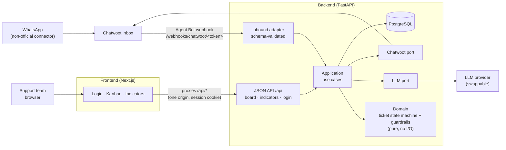
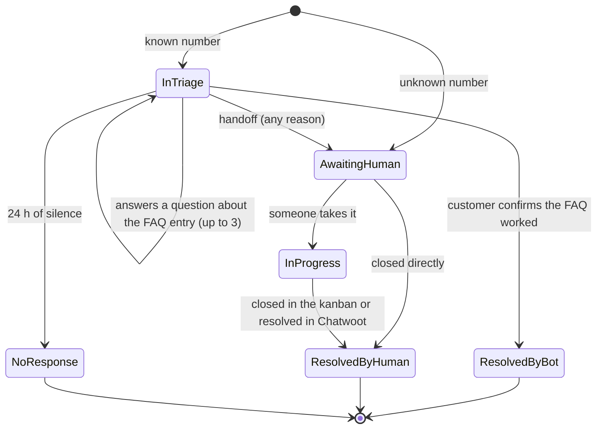

# Single-Agent Support Bot — Design

- **Date:** 2026-09-23
- **Status:** design approved in brainstorming; written spec under review
- **Scope:** the support chatbot (one LLM agent), the ticket board (kanban) and the indicators page

## 1. Summary

Customers — people working at our client units — message our support WhatsApp number. The bot
identifies them by phone number against a base we maintain, opens a ticket right away, listens to the
problem and, when the problem matches an entry in our FAQ, sends that entry's instructions once. It
answers a few questions about those instructions, only from that entry's knowledge base. If the
customer asks for a person at any moment, the bot hands the conversation over immediately.

Every ticket lands on a kanban board that the support team controls, already summarized and
categorized. Because every ticket carries its unit, category and outcome as structured fields, the
same data answers: which problems happen most, how many tickets were solved and how, and which units
suffer most from a given problem.

## 2. Goals and non-goals

**Goals**

- Identify the customer by phone number only, before anything else happens.
- Open a ticket as soon as the customer is identified.
- Resolve known problems with a single FAQ attempt, using text written by the support team.
- Hand over to a human immediately whenever the customer asks for one.
- Deliver every ticket to a kanban with a summary, a category, the unit and the outcome.
- Provide indicators by period, unit and category.

**Non-goals**

- The bot **never executes anything** in customer systems (no adding or removing users, no changing
  numbers). It identifies, understands, answers from the FAQ, summarizes and hands over.
- The bot does not troubleshoot beyond the FAQ and does not invent procedures.
- No video or document understanding. Images and audio were added later, each behind its own setting:
  the LLM reads images (`LLM_READS_IMAGES`), and audios of up to 2 min are transcribed by a separate
  endpoint (`TRANSCRIBE_*`) and read as the customer's text (see `docs/architecture.md`, "Attachments").
- No per-person logins, no report export, no e-mailed reports, no period-over-period comparison.

## 3. Decisions taken in brainstorming

| # | Decision | Alternatives rejected | Why |
|---|---|---|---|
| 1 | **One LLM agent** conducts the conversation. There is no numbered menu and no external form. | Hybrid (agent plus a form for structured requests) | The agent collects and summarizes the problem itself; the ticket is the deliverable. |
| 2 | **Code on rails, LLM as interpreter.** Code owns the flow; the LLM is called once per customer turn and returns JSON validated by a schema. | Free agent with tools; the LLM in a service of its own | Business rules become testable `if`s instead of prompt requests. One call per turn keeps cost and latency down. The LLM call lives in the backend next to the rules that consume it; a service just for it adds a deployable for no gain. |
| 3 | The **kanban lives inside this project** — same repository, same database: the backend serves it as a JSON API and the frontend renders it. | Reusing an external dashboard; using Chatwoot as the board | One source of truth; indicators come straight from the same tables. |
| 4 | **Five columns, in this order:** Resolved by bot → Awaiting human → In progress → Resolved by human → No response. | Two columns (resolved / open) | Keeps "nobody took it yet" apart from "someone is on it", which the waiting-time indicator needs. Keeps customers who vanished from inflating the bot's success rate. |
| 5 | **Closed category list** (system + problem), with "Other". The agent can only choose from it; humans can correct it on the card. | Free categories written by the agent; closed list plus a free tag | Charts stay comparable over time. |
| 6 | **One FAQ attempt per problem, FAQ-only.** The entry's text is sent once, verbatim; another problem raised after it gets its own entry, or goes to a person when none covers it. Then the bot answers up to three questions about it, only from that entry's knowledge base. No FAQ match, or a question its knowledge base does not answer, means summarize and hand over. | Two attempts; letting the agent suggest solutions outside the FAQ; answering from every entry's knowledge base | Every instruction and every answer the customer receives comes from what the team wrote; "resolved by bot" means "resolved by the FAQ". |
| 7 | **Single shared login**; the responsible person is chosen on the card. | Individual logins | Simpler for a two-person team. Move history still records *when*, not *who*. |
| 8 | **The LLM is provider-agnostic**; the model is chosen by a comparative evaluation once the agent works. DeepSeek V4.1 Flash is the leading candidate (see §12). | Committing to DeepSeek now | Latency and behavior are measured on our own conversations before committing. |
| 9 | The bot is a **Chatwoot Agent Bot**. The WhatsApp number is connected to Chatwoot through a non-official connector. | Receiving WhatsApp webhooks directly | Our number does not use the official API, and humans answer customers inside Chatwoot. |
| 10 | **Registration confirmation is kept.** If the customer says they are not the registered person, or that they are from a different unit, the bot stops and hands over. | Continuing and flagging the mismatch | A conservative cut: a wrong identity must not flow into an automated answer. |
| 11 | **No personal-data filtering in the prompt.** The LLM may receive the customer's name, unit and messages. | Keeping name, unit and phone out of the prompt | Owner's decision. |
| 12 | Core principles: **identify by phone only**; **unknown number goes to a human, never to the FAQ**; **the bot never executes** (see §2). | — | Reconfirmed during this brainstorming. |
| 13 | **Stack:** backend in Python (FastAPI), frontend in React + Next.js, one PostgreSQL database, tests against a real PostgreSQL. | — | Owner's decision. |

## 4. Architecture


```mermaid
flowchart LR
    WA["WhatsApp<br/>(non-official connector)"] --> CW["Chatwoot inbox"]
    CW -- "Agent Bot webhook<br/>/webhooks/chatwoot/&lt;token&gt;" --> IN

    subgraph BE["Backend (FastAPI)"]
        IN["Inbound adapter<br/>schema-validated"] --> APP["Application<br/>use cases"]
        APP --> DOM["Domain<br/>ticket state machine + guardrails<br/>(pure, no I/O)"]
        APP --> LLMP["LLM port"]
        APP --> CWP["Chatwoot port"]
        APP --> DB[("PostgreSQL")]
        API["JSON API /api<br/>board · indicators · login"] --> APP
    end

    subgraph FE["Frontend (Next.js)"]
        UI["Login · Kanban · Indicators"]
    end

    Browser["Support team<br/>browser"] --> UI
    UI -- "proxies /api/*<br/>(one origin, session cookie)" --> API
    LLMP --> LLM["LLM provider<br/>(swappable)"]
    CWP --> CW
```

- **Domain** holds the ticket state machine, the counters (one FAQ attempt per problem, at most three questions
  answered about it, at most one clarifying question) and the precedence rules of §5.3. It has no
  I/O and is unit-tested.
- **LLM port** hides the provider. Swapping models means writing one adapter.
- **Chatwoot port** sends messages, toggles conversation status, reads a conversation's latest
  messages and builds conversation links.
- **Baseline stack:** backend in Python 3.12 with FastAPI, Pydantic (every inbound payload and every
  LLM output), SQLAlchemy Core on asyncpg and PostgreSQL; frontend in Next.js (App Router), React and
  TypeScript, with API types generated from the backend's OpenAPI schema. The Chatwoot webhook goes
  to the backend directly; the browser only talks to the frontend, which proxies `/api/*`.
- The customer-facing language is **Brazilian Portuguese**. Code and docs are in English.

## 5. Conversation flow

### 5.1 Steps

1. **A message arrives** through the Chatwoot Agent Bot webhook. Duplicate deliveries are ignored by
   message id. Until its first reply in the ticket, the bot waits for **4 s of silence** and processes a
   burst of short messages ("oi", "tudo bem?", "meu número caiu") as one turn; after it, it answers at
   once. A message that arrives while the bot prepares a reply drops that reply, so one reply answers
   both, unless the reply closes the ticket or the oldest message it answers waited more than 30 s.
2. **Identification (code, before anything else).** The sender's phone is normalized to E.164,
   including the Brazilian 9th mobile digit, and looked up in the `attendant` table.
   - **Unknown number:** a ticket is created directly in **Awaiting human** with category
     "Unidentified" and handoff reason `unidentified`. The bot replies with a fixed acknowledgement
     only ("recebemos sua mensagem, a equipe de suporte vai te responder por aqui"). No FAQ is ever offered.
   - **Known number:** a ticket is created in the hidden state **in triage**.
   - **The team is talking:** before any ticket, the bot reads the conversation's latest messages
     through Chatwoot's API. If someone of the team wrote in it since it was last closed (a ticket
     closed or the conversation resolved in Chatwoot), the bot stays out: no ticket, no reply, the
     conversation opened for the team. The bot's own messages, the connector's echoes and private notes
     do not count; if Chatwoot does not answer, the bot carries on. Before each turn of a ticket in
     triage the same check runs since the ticket opened; if the team wrote, the ticket goes to
     **Awaiting human** (`team_replied`) with no reply.
3. **Greeting (code, not the LLM).** It uses the registered name and unit and asks the customer to
   confirm them. When the first messages are only a greeting ("oi", "bom dia, tudo bem?": every word,
   in lowercase without accents, punctuation or emoji and with a letter repeated in a row counted as
   one, so "oii" and "bom diaa" too, is in a short list of greeting words that includes slang such as
   "eae" and "iae", or there is no text), it also asks for the problem. When they already say something (any other word, or a
   photo, audio or file), it only asks for the confirmation; the next turn takes the problem from
   those messages instead of asking for it again.
4. **Each customer turn** goes to the LLM (§6). Code applies the result using the precedence in §5.3.
5. **FAQ match:** the bot sends the FAQ entry's **verbatim text**, with no sentence before it; the LLM
   never writes the procedure. With it the bot asks whether it solved the problem ("Responda sim ou não").
   - Resolved, including a short thanks or confirmation ("ok", "entendi", "valeu") → **Resolved by bot**.
   - Another problem ("e sobre o login?", even "sim, mas e o login?") → that problem's FAQ entry, sent
     the same way, whose feedback is read next (its questions and unclear answers counted anew); with no
     entry for it → **Awaiting human** (`no_faq_match`).
   - Not resolved, including "that's not it" → **Awaiting human** (`faq_not_resolved`).
   - A question about the instructions → the LLM answers it **only from that entry's text and
     knowledge base** and the conversation, never from general knowledge or other entries; the bot
     sends the answer alone, and reads the next message as the feedback. It answers **at most three**
     questions. A question the knowledge base does not answer, one off the entry's subject, or a
     fourth one → **Awaiting human** (`faq_not_resolved`), with the question in the ticket summary.
   - Unclear answer ("vou testar mais tarde") → the bot asks once more ("Só pra eu confirmar: as
     instruções resolveram o problema?"); a second unclear answer → **Awaiting human**. A question
     does not count as an unclear answer.
6. **No FAQ match:** the LLM may ask **at most one clarifying question**, and only when the customer has
   not yet said what the problem is; then the ticket goes to **Awaiting human** (`no_faq_match`). A clear
   request that no FAQ entry covers goes to **Awaiting human** at once, with no question.
7. **Handoff:** the bot tells the customer the team will take over, sets the ticket to
   **Awaiting human**, switches the Chatwoot conversation from bot-handled to open, and **stays
   silent** in that conversation while the ticket is open.
8. **Messages on an open ticket** (Awaiting human or In progress) attach to that ticket; the bot does
   not answer. After a ticket is closed (Resolved by bot, Resolved by human or No response), the next
   message opens a new ticket. That includes messages that arrive while the turn that closes the ticket
   as Resolved by bot is running: the ticket closes as decided, and those messages, which may be another
   problem, open a new ticket that goes through identification and gets its own turn. If a person moved
   the ticket out of triage during the turn, the turn sends nothing.
9. **Silence:** a ticket still in triage, or waiting for FAQ feedback (also after a question was
   answered), with no customer message for **24 h** (configurable) goes to **No response**.
10. **Media** the bot cannot read (a video, a document, an image that did not open, an audio longer than
    2 min or whose transcription failed, or any audio or image with its setting off): the bot asks the
    customer to type the problem, once. Media again → **Awaiting human** (`media`). A transcribed audio
    is not media: it counts as the customer's text in every step, transcribed at the start of the turn,
    and its transcription goes to the team as a private note in the Chatwoot conversation.

### 5.2 Ticket lifecycle


```mermaid
stateDiagram-v2
    [*] --> InTriage: known number
    [*] --> AwaitingHuman: unknown number
    InTriage --> InTriage: answers a question about the FAQ entry (up to 3)
    InTriage --> ResolvedByBot: customer confirms the FAQ worked
    InTriage --> AwaitingHuman: handoff (any reason)
    InTriage --> NoResponse: 24 h of silence
    AwaitingHuman --> InProgress: someone takes it
    AwaitingHuman --> ResolvedByHuman: closed directly
    InProgress --> ResolvedByHuman: closed in the kanban or resolved in Chatwoot
    ResolvedByBot --> [*]
    ResolvedByHuman --> [*]
    NoResponse --> [*]
```

"In triage" is **not a kanban column**. The board shows it as a counter ("3 conversations with the
bot now"). The ticket enters one of the five columns once it has an outcome. Humans can drag cards
between columns freely; every move is recorded.

### 5.3 Precedence rules (enforced in code)

For each customer turn, the first rule that applies wins:

1. **Human requested** — a keyword check in code runs **before** the LLM call (for example
   "atendente", "humano", "pessoa", "falar com alguém"), and the LLM also flags it. Either one
   triggers the handoff. It keeps working if the LLM is down.
2. **Registration mismatch** — the customer denies the registered name or unit → handoff
   (`registration_mismatch`).
3. **Off-topic or suspicious** content → handoff (`off_topic`).
4. **Awaiting FAQ feedback** → apply step 5 of §5.1, in this order: another problem → its own FAQ
   entry when one matches and it is not the entry sent, otherwise handoff (`no_faq_match`); resolved →
   Resolved by bot; not
   resolved → handoff (`faq_not_resolved`); a question whose answer the LLM found in the entry's
   knowledge base, with a non-empty reply, and fewer than three questions answered → answer it; any
   other question → handoff (`faq_not_resolved`); unclear or no feedback → ask once more, then handoff.
5. **FAQ match**, and no FAQ entry sent yet → send the FAQ entry.
6. **Clarification needed** (the customer has not yet said what the problem is), and no question asked
   yet → ask.
7. Otherwise → handoff (`no_faq_match`).

## 6. LLM contract

**Input:** system prompt (role, tone, the rules above), the active category list, the active FAQ
entries (id, category, title and "when it applies" description; answer texts and knowledge bases
stay out), the customer's registered name and unit, the counters' state (including
`faq_questions_answered` and `max_faq_questions`), the triage conversation the bot
has already answered (`conversation`) and, after it, the customer messages of this turn
(`new_messages`: those after the last message a turn has read). The system prompt tells the model to
decide the turn from `new_messages`. A message that arrives while the model is working on a turn is
stored before that turn's reply, so in the plain conversation it would look answered; sending it in
`new_messages` keeps it visibly pending for the next turn.

Once the FAQ entry was sent, the input also has `sent_faq`: that entry only (id, title, answer text
and knowledge base), the one source for answering questions about it. Before the entry is sent there
is no `sent_faq`, and no answer text or knowledge base reaches the model.

**Output** (validated with Pydantic; categories and FAQ ids must come from the lists sent in the
input):

```json
{
  "human_requested": false,
  "registration_mismatch": false,
  "off_topic": false,
  "category_id": 3,
  "faq_item_id": 12,
  "faq_feedback": null,
  "faq_answer_found": false,
  "needs_clarification": false,
  "summary": "Não consegue entrar no painel; diz que a senha está errada.",
  "reply": "Veja se isto resolve:",
  "handoff_reply": ""
}
```

- `category_id` must be in the active list; anything else rejects the output.
- `faq_item_id` is an FAQ id or `null`; an unknown id is treated as `null`.
- `faq_feedback` is `"resolved"`, `"not_resolved"`, `"question"` (the customer asks about the
  instructions sent), `"unclear"`, `"new_problem"` (the customer raises a problem other than the
  entry's; `faq_item_id` is then that problem's entry, or `null`) or `null`.
- `faq_answer_found` (default `false`) says, for a question, that its answer is in `sent_faq`'s text
  or knowledge base (or the conversation) and on the entry's subject.
- `summary` (1–1000 characters) is what the kanban card shows; `reply` (0–1000) is a clarifying
  question or the answer to a question about the entry sent, written only from `sent_faq`; it is
  empty when an FAQ entry is chosen, and never an FAQ procedure.
  It is empty when the answer was not found. Booleans are strict: `"true"` is not a boolean.
- `handoff_reply` (optional, default `""`) is the sentence to the customer when the turn hands the
  ticket to the team, written only when the model's own reading points to a handoff (a request for a
  person, a registration mismatch, off-topic, FAQ feedback "not resolved" or unclear, a question whose
  answer was not found, another problem with no FAQ entry, or no FAQ entry fits and no clarification is
  needed). It is one or two short
  sentences that name the customer's subject in their own words and say the conversation went to the
  support team, which carries on in this chat. It answers nothing, asks nothing, and promises no time,
  no speed and nothing about what the team will do; the prompt's examples show only the format, so the
  sentence varies with the subject. It is read leniently: a value that
  is not text, or longer than 300 characters, becomes `""` and never rejects the output. The code still
  decides whether there is a handoff; it uses this sentence only when the model read the turn as one,
  and otherwise (a handoff before the LLM, a limit only the code knows, an empty sentence) sends its
  fixed text.

There is **no action field**: the LLM has no way to ask for anything to be executed. The model runs
without its reasoning mode, to keep latency within the target.

## 7. Data model

| Table | Purpose | Key fields |
|---|---|---|
| `unit` | Client units | id, name, active |
| `attendant` | The customer base, loaded by the team | id, phone_e164 (unique), name, unit_id, active |
| `category` | Closed list, never deleted | id, system, name, active, created_at |
| `faq_item` | FAQ entries, editable without deploy | id, category_id, title, applies_when, answer_text, knowledge_base, active |
| `team_member` | People who can be responsible | id, name, active |
| `ticket` | The canonical ticket | see below |
| `ticket_move` | Column history | ticket_id, from, to, at, actor (`bot` / `human`) |
| `triage_message` | Conversation with the bot, used as LLM context | ticket_id, author, text, at, chatwoot_message_id |
| `conversation_resolution` | When each conversation was last resolved in Chatwoot, with or without a ticket | conversation_id, resolved_at |

**`ticket` fields:** id, attendant_id (null when unidentified), unit_id (snapshot), phone_e164,
column (`in_triage`, `resolved_by_bot`, `awaiting_human`, `in_progress`, `resolved_by_human`,
`no_response`), category_id (current), **bot_category_id (the agent's original choice, kept to
measure its accuracy)**, handoff_reason (`human_requested`, `faq_not_resolved`, `no_faq_match`,
`unidentified`, `registration_mismatch`, `off_topic`, `media`, `llm_failure`, `team_replied`), faq_item_id,
faq_attempted, faq_questions_answered, clarifications_asked, summary, responsible_id (null =
unassigned), chatwoot_conversation_id, opened_at, handed_off_at, taken_at, closed_at.

## 8. Kanban

- **Columns:** Resolved by bot · Awaiting human · In progress · Resolved by human · No response,
  plus the "conversations with the bot now" counter.
- **Order:** open columns (Awaiting human, In progress) list the longest wait first, by the time of
  the last move; the board shows at most 500 of them, so the cut drops the newest cards, never the
  ones waiting longest. Closed columns show their 50 most recent cards, newest first.
- **Card:** unit, category, summary, responsible, time since the last move, link to the Chatwoot
  conversation.
- **Actions:** drag between columns; **take** (pick who is taking it — the login is shared — which
  sets the responsible person and moves the card to In progress; on a closed card it reopens it);
  **remove the responsible** (only in In progress; the card goes back to Awaiting human); correct the
  category; resolve (asks for confirmation, since it also resolves the Chatwoot conversation).
- **Moves are free for people** (owner, 2026-09-23): dragging a card, or "Mover para", into In
  progress moves it without a responsible person; only **take** sets one. A person may also move a
  card into Resolved by bot.
- **Chatwoot sync, both ways:** closing a card resolves the Chatwoot conversation, and resolving the
  conversation in Chatwoot moves the card to Resolved by human. Nobody has to close the same thing
  twice.
- **Login:** one shared credential from the backend's environment variables; the backend signs an
  httpOnly, `SameSite=Lax` session cookie (12 h), and the frontend reaches it through its `/api` proxy,
  so the cookie is first-party.

## 9. Indicators

One page, filtered by period and unit. Everything is computed from the tables in §7.

1. **Volume** — tickets per week and month: total, by unit, by category.
2. **Outcomes** — distribution across the five columns and, for handed-off tickets, by handoff reason.
   **Bot resolution rate** = Resolved by bot ÷ identified tickets that reached a column. No response
   is shown as its own share, so it never counts as a success.
3. **Unit × category heatmap** — the "which unit suffers most from problem X" view, with an option to
   normalize by the number of attendants per unit so larger units do not always look worst. Tickets
   from unknown numbers form a "No unit" row, which normalization leaves as a dash (it has no
   attendants). An inactive unit with tickets in the period keeps its row. Only tickets without a
   category stay out of the heatmap, and the page says how many.
4. **Time** — time in Awaiting human until someone takes it, and time until close.
5. **FAQ health** — per entry: times used and share confirmed as resolved. Low shares flag text to
   rewrite.
6. **Agent health** — share of categories corrected by humans (classification error) and the share
   falling into "Other". A growing "Other" signals a missing category.

## 10. Error handling

- **LLM timeout (~8 s), provider error or invalid JSON:** one retry. If it fails again, the ticket goes
  to **Awaiting human** (`llm_failure`) and the customer is told the team will take over. The customer
  never goes unanswered.
- **Chatwoot send failure:** every outbound message and status change is a row of a transactional
  outbox, written in the same transaction as the ticket change; a worker sends the rows after the
  commit, in order per conversation, and sends what a stopped process left pending when it starts
  again. Nothing is sent before the commit and nothing is lost when the process stops. Board actions
  answer without waiting for Chatwoot.
  A send is repeated only when it surely was not processed (connection failure, or a 502/503/504
  answer); never after a read timeout or another answer, so the customer never gets a message twice.
  A call that still fails is marked failed in the outbox and logged; it is not tried again.
- **Duplicate webhooks:** ignored by Chatwoot message id.
- **Message bursts:** grouped by the 4 s silence window before the bot's first reply (§5.1).
- **Media:** handled as in §5.1, step 10.

## 11. Testing

- **Unit tests (TDD)** for the domain: ticket transitions, the precedence rules, the FAQ-attempt and
  clarification counters, the 24 h silence rule, and phone normalization (including 12- vs 13-digit
  Brazilian mobiles). The LLM is replaced by a fake.
- **Schema tests** for the LLM output: unknown category rejected, unknown FAQ id treated as null.
- **Evaluation set:** about 30 anonymized sample conversations run against the real model. It
  reports, per model:
  - human-request detection — **must be 100%** (a blocking requirement);
  - category accuracy against the expected label;
  - FAQ match accuracy;
  - questions about the FAQ entry sent: answered when its knowledge base has the answer, handed over
    when it does not;
  - p50 and p95 latency, measured from Brazil.

  **This same set is the model comparison** of decision 8: candidates run side by side on it.

## 12. LLM cost analysis — DeepSeek V4.1 Flash (candidate)

Source: official API pricing page (api-docs.deepseek.com, model `deepseek-flash`, released
2026-09-10). US$ per 1M tokens:

| | Off-peak | Peak |
|---|---|---|
| Input, cache hit | 0.003 | 0.006 |
| Input, cache miss | 0.15 | 0.30 |
| Output | 0.60 | 1.20 |

- Peak hours are 01:00–04:00 and 06:00–10:00 UTC on weekdays, which is **22:00–01:00 and
  03:00–07:00 in Brasília time**. Business hours fall entirely **off-peak** (50% of peak).
- 1M-token context; JSON output and tool calls supported.
- **Estimate:** about 8 LLM calls plus one summary per ticket; ~3k tokens of system prompt and FAQ
  cached; ~800 new input tokens and ~250 output tokens per call; reasoning mode off. That comes to
  **≈ US$ 0.003 per ticket**, so **≈ US$ 3 per 1,000 tickets**. A pessimistic case (long chats, no
  cache, peak hours) stays under US$ 20 per 1,000 tickets. Cost is not a deciding factor.
- **Known facts to weigh in the comparison:** the provider processes API data on its own servers in
  China; the model was 13 days old when this was written, so pricing and behavior may still change;
  latency from Brazil is unmeasured.

## 13. Open items

These are not decided yet. None of them blocks the implementation.

- **FAQ content and the category list** — written by the support team. The content is in
  `backend/faq/faq.json`, loaded with `python -m geniai.db.cli load-faq`. Knowledge-base points the
  team has not confirmed stay out of the file until they are.
- **Model choice** — decided by the evaluation set (§11).
- **Connector check:** confirm that Chatwoot contacts from this inbox carry the real phone number.
  Some non-official connectors deliver an internal WhatsApp id instead, which would break
  identification.
- **Chatwoot events:** confirm which webhook (Agent Bot or account webhook) delivers conversation
  status changes for the two-way sync.
- **Loading the attendant base:** how the team loads and updates `attendant` and `unit` (seed script,
  CSV import or a screen).
- **Hosting and deploy.**
- **Known risk:** a non-official WhatsApp connector can get the number banned, and there is only one
  support number.
